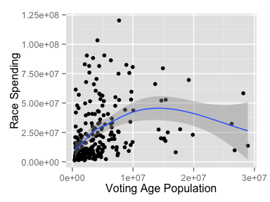

    library(ggplot2)
    ss <- as.data.frame(read.csv("/Jobs/CRP/senate_spending_final.csv"))
    summary(ss)

    ##      cycle           race        inc               cpvi        
    ##  Min.   :2002   DES2   :  4   Mode :logical   Min.   :-20.000  
    ##  1st Qu.:2004   AKS1   :  3   FALSE:54        1st Qu.: -4.000  
    ##  Median :2008   ALS1   :  3   TRUE :188       Median :  2.000  
    ##  Mean   :2008   ARS1   :  3   NA's :0         Mean   :  2.822  
    ##  3rd Qu.:2012   COS2   :  3                   3rd Qu.:  9.000  
    ##  Max.   :2014   GAS1   :  3                   Max.   : 22.000  
    ##                 (Other):223                                    
    ##     spec         opp_party            vap                gdp         
    ##  Mode :logical   Mode :logical   Min.   :  376121   Min.   :  19295  
    ##  FALSE:239       FALSE:201       1st Qu.: 1331461   1st Qu.:  66111  
    ##  TRUE :3         TRUE :41        Median : 3136674   Median : 168888  
    ##  NA's :0         NA's :0         Mean   : 4446083   Mean   : 271815  
    ##                                  3rd Qu.: 5129891   3rd Qu.: 329756  
    ##                                  Max.   :28913129   Max.   :2125717  
    ##                                                                      
    ##     outside              cand              total          
    ##  Min.   :      19   Min.   : 1130177   Min.   :  1130602  
    ##  1st Qu.:   53083   1st Qu.: 6587574   1st Qu.:  6865478  
    ##  Median :  982706   Median :12379183   Median : 15068202  
    ##  Mean   : 6506165   Mean   :17070758   Mean   : 23576923  
    ##  3rd Qu.: 6448665   3rd Qu.:22618146   3rd Qu.: 32316802  
    ##  Max.   :83029043   Max.   :82390661   Max.   :120227038  
    ## 

    qplot(vap, total, data=ss, xlab='Voting Age Population', ylab = 'Race Spending') + geom_smooth()

